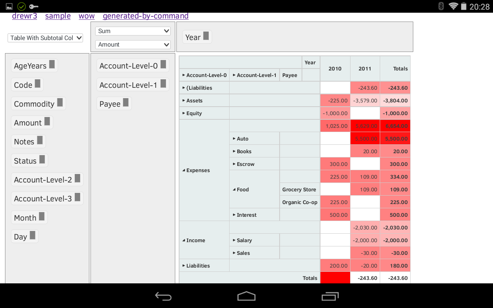
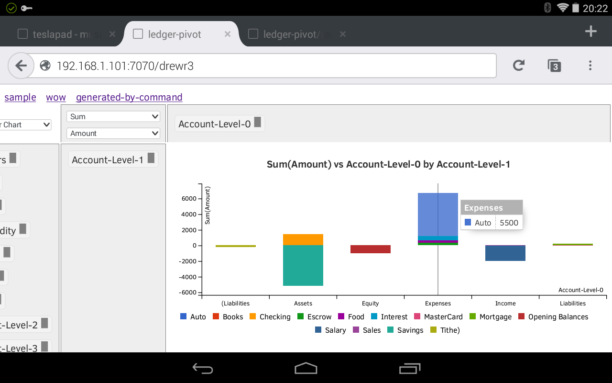

## ledger-pivot

View [ledger] transactions in a [pivot-table] in a web browser:

- drag-drop headings
- drill-down: click a cell to view its transactions
- [subtotals][pivot-subtotal] and charts
- pivot table layouts are automatically persisted to disk
- define multiple reports via configuration

## Screenshots

## install and run

With [node.js] installed:

    $ npm install -g ledger-pivot  # might need to prefix with sudo
    $ ledger-pivot

then navigate your web-browser to `http://your-server:7070` to view the [examples].

## configure

Configuration files live in directory `~/.config/ledger-pivot` unless
you've changed your [$XDG_CONFIG_HOME] variable.
This location can be overridden with the `-c` flag on the command line.

The [settings.yaml] should be edited as required, specifying the source
of transaction csv data and (optionally) the pivot table's initial configuration.

## options

    $ ledger-pivot --help
    Usage: ledger-pivot [options]

    Options:

      -h, --help                output usage information
      -V, --version             output the version number
      -c, --config-path [path]  path to configuration files
      -p, --port [port]         listening port (default:7070)

## developer build and run

With [node.js] installed on the target box:

    $ git clone --branch=dev https://github.com/dizzib/ledger-pivot.git
    $ cd ledger-pivot
    $ npm install       # install project dependencies
    $ npm start         # build and start the task runner
    ledger-pivot > b.a  # build all and start server

Then navigate your web-browser to `http://your-server:7070` to view the [examples].

## license

[MIT](./LICENSE)

[$XDG_CONFIG_HOME]: http://standards.freedesktop.org/basedir-spec/basedir-spec-latest.html
[examples]: ./site/example
[ledger]: http://www.ledger-cli.org
[node.js]: http://nodejs.org
[pivot-subtotal]: http://nagarajanchinnasamy.com/subtotal
[pivot-table]: http://nicolas.kruchten.com/pivottable
[settings.yaml]: ./site/config/settings.yaml
